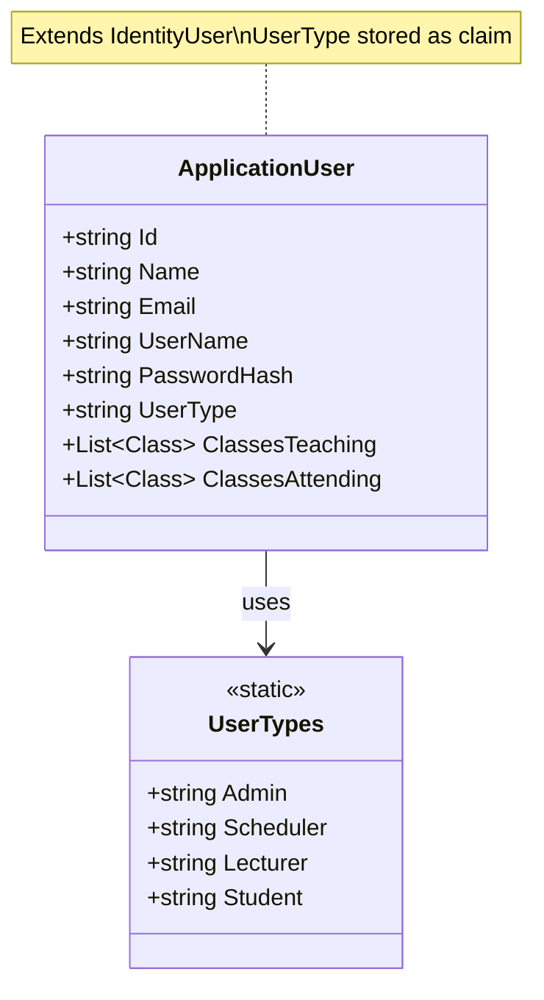
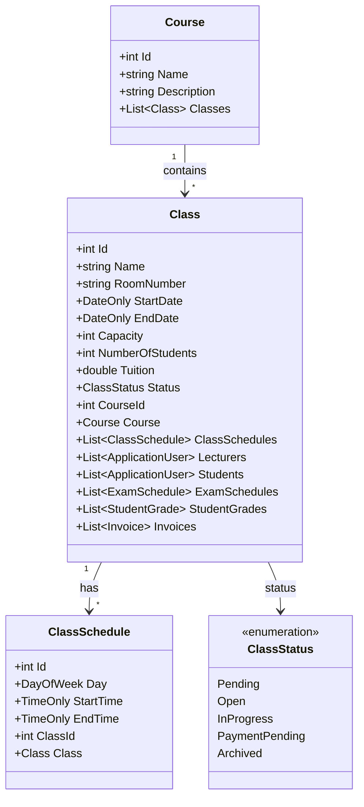
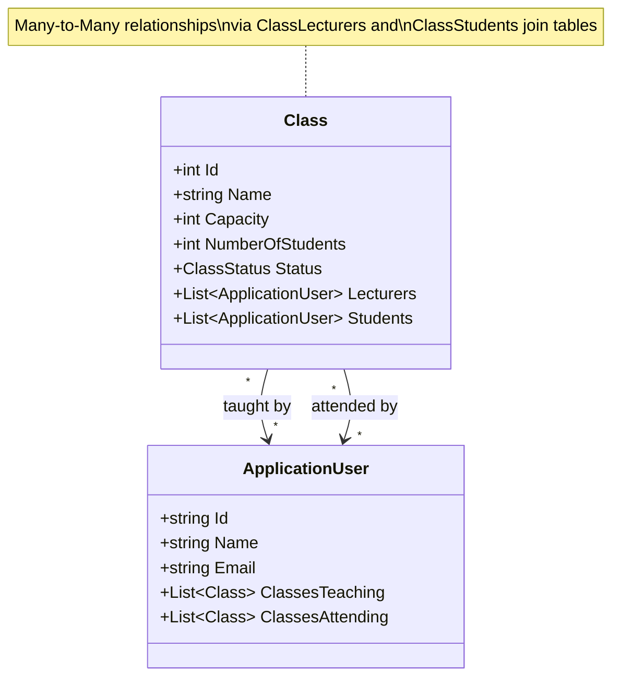
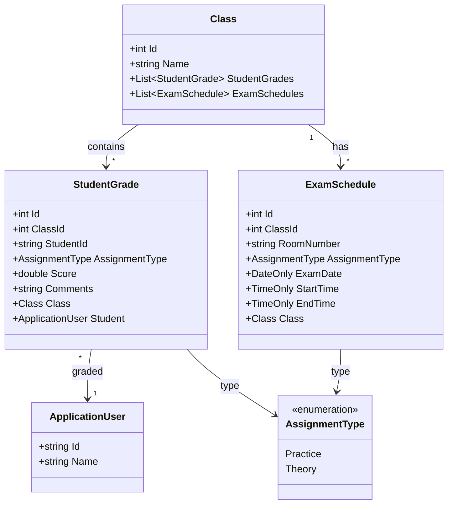
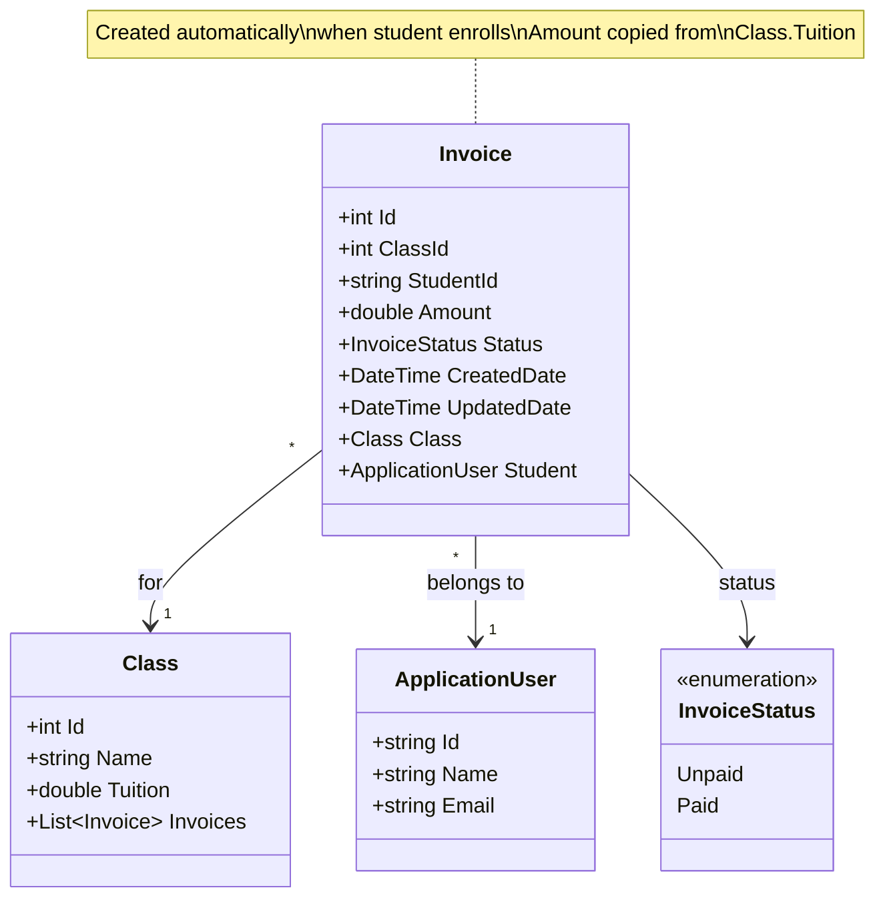
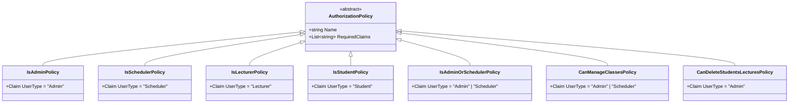
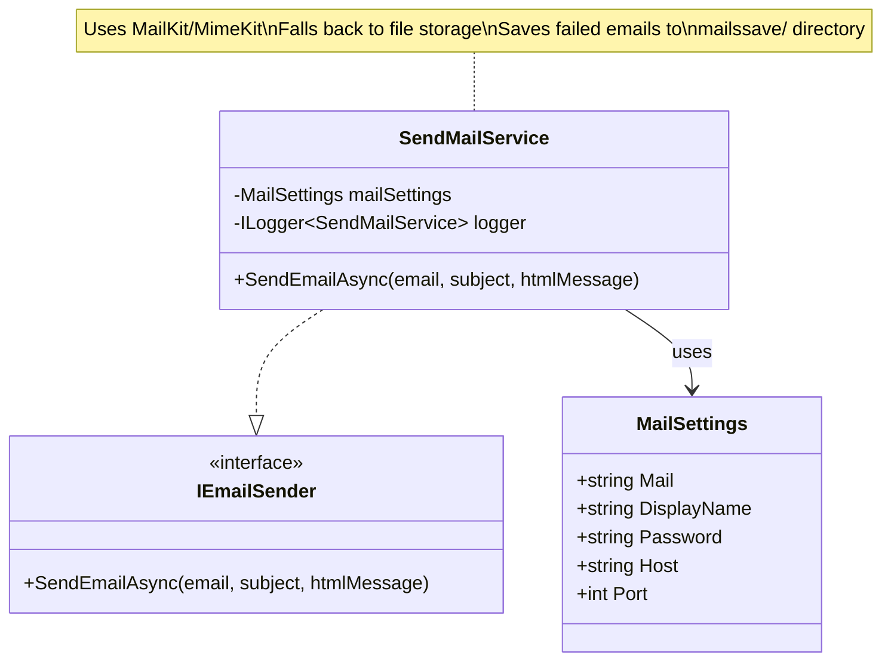

# EduTech - Educational Technology Management System

A comprehensive ASP.NET Core MVC application for managing educational institutions, including course management, class scheduling, student enrollment, grading, and billing with role-based access control.

## Table of Contents
- [Overview](#overview)
- [Technology Stack](#technology-stack)
- [Key Features](#key-features)
- [System Architecture](#system-architecture)
- [Setup Instructions](#setup-instructions)
  - [Prerequisites](#prerequisites)
  - [Installation Steps](#installation-steps)
- [Database Schema](#database-schema)
- [Class Diagrams](#class-diagrams)
- [User Roles and Permissions](#user-roles-and-permissions)
- [Default Accounts](#default-accounts)
- [Project Structure](#project-structure)
- [Development Workflow](#development-workflow)
- [MVC Routes](#mvc-routes)
- [Business Rules](#business-rules)
- [Security Considerations](#security-considerations)
- [Testing](#testing)
- [Contributing](#contributing)
- [License](#license)
- [Acknowledgments](#acknowledgments)

---

## Overview

EduTech is a full-featured educational management system designed to streamline the operations of training centers and educational institutions. The system handles the complete lifecycle of classes from creation to completion, including:

- Course and class management
- Lecturer assignment and schedule conflict detection
- Student enrollment and capacity management
- Automated invoice generation and payment tracking
- Grading and exam scheduling
- Calendar visualization of schedules
- Role-based dashboards for different user types

## Technology Stack


- **Framework:** ASP.NET Core 9.0 MVC
- **ORM:** Entity Framework Core 9.0
- **Database:** SQL Server
- **Authentication:** ASP.NET Core Identity
- **Template Engine:** Razor Pages (.cshtml)
- **Email Service:** MailKit/MimeKit (SMTP)
- **UI Components:** Syncfusion EJ2 AspNet.Core Components


---

## Key Features

### Administrative Features
- **Course Management**: Create, edit, and delete courses with descriptions
- **Class Management**: Create classes with schedules, room assignments, and capacity limits
- **User Management**: Manage students, lecturers, schedulers, and administrators
- **Exam Scheduling**: Create and manage exam schedules for classes
- **Invoice Management**: View and process student payment invoices
- **Class Operations**:
  - Merge multiple classes with student consolidation
  - Transfer students between classes
  - Change class status through lifecycle
- **Dashboard**: View system statistics (total classes, courses, lecturers, students)

### Scheduler Features
- All administrative features (via policy-based authorization)
- Manage class lifecycle transitions (Pending → Open → InProgress → PaymentPending → Archived)
- Schedule exam dates and times
- Process student payments and invoice management

### Lecturer Features
- **Class Registration**: Register to teach available classes (Pending status)
- **Schedule Management**: Automatic schedule conflict detection
- **Teaching Dashboard**: View classes currently teaching with calendar visualization
- **Teaching History**: View complete teaching history grouped by status
- **Grading**: Grade students with Practice and Theory assignment types
- **Cancel Teaching**: Option to cancel teaching assignments

### Student Features
- **Browse Classes**: View available classes (Open status only)
- **Enrollment**: Enroll in classes with automatic invoice generation
- **Schedule Conflict Detection**: Prevents enrollment in overlapping classes
- **Calendar View**: Visualize enrolled classes with Syncfusion calendar
- **Grades**: View grades per class or all grades across classes
- **Exam Schedules**: View exam schedules for in-progress classes
- **Invoice Management**: View invoices with paid/unpaid status
- **Cancel Enrollment**: Withdraw from classes before they start

### System Features
- **Schedule Conflict Detection**: Prevents double-booking for both lecturers and students
- **Class Lifecycle Management**: Structured workflow from creation to archival
- **Capacity Management**: Automatic tracking of enrolled students vs. capacity
- **Email Integration**: SMTP-based email service with fallback to file storage
- **Role-Based Access Control**: 4 user types with granular policy-based permissions
- **Automated Invoice Generation**: Invoices created automatically on enrollment
- **Grading System**: Support for Practice and Theory assignment types

---

## System Architecture

### MVC Architecture
EduTech follows the Model-View-Controller pattern with server-side rendering:

- **Models**: Entity classes representing database tables and view models for UI
- **Views**: Razor templates (.cshtml) for rendering HTML on the server
- **Controllers**: Handle HTTP requests and coordinate between models and views

### Authentication & Authorization
- **Claim-based authentication** using ASP.NET Core Identity
- **Policy-based authorization** with custom policies for each user type
- **Email confirmation** required for account activation
- **Password requirements**: Minimum 8 characters, must include digits and special characters

### Email Service
- **SMTP-based email** using MailKit and MimeKit libraries
- **Configurable mail settings** via `appsettings.Development.json`
- **Fallback mechanism**: Failed emails are saved to `mailssave/` directory as .eml files
- **Logging**: Comprehensive logging for email operations


---

## Setup Instructions

### Prerequisites
- **.NET 9.0 SDK** or later
- **SQL Server** (LocalDB, Express, or Full Edition)
- **Visual Studio 2022** or **VS Code** with C# extension
- **SMTP Server** access (Gmail, Outlook, or custom SMTP server)
- **Syncfusion License** (Community or Commercial)

### Installation Steps

#### 1. Database Setup

**Using Docker for SQL Server:**

```bash
docker run -e "ACCEPT_EULA=Y" -e "MSSQL_SA_PASSWORD=SQLServer123@" \
-p 1433:1433 --name sqlserver -d \
mcr.microsoft.com/mssql/server:2022-latest
```

**Connect to SQL Server** using your preferred tool (SSMS, DBeaver, etc.):
- **Server**: `localhost`
- **Username**: `sa`
- **Password**: `SQLServer123@`

#### 2. Clone the Repository

```bash
git clone https://github.com/nthxxg/EduTech-MVC.git
cd EduTech-MVC
```

#### 3. Configure Database Connection

Update `appsettings.json` or `appsettings.Development.json` with your SQL Server connection string:

```json
{
  "ConnectionStrings": {
    "DefaultConnection": "Server=localhost;Database=EduTechDB;User ID=sa;Password=SQLServer123@;TrustServerCertificate=True;"
  }
}
```

#### 4. Install Entity Framework Core Tools

```bash
dotnet tool install --global dotnet-ef
```

#### 5. Configure Email Service

Add your SMTP settings to `appsettings.Development.json`:

```json
{
  "MailSettings": {
    "Mail": "noreply@edutech.com",
    "DisplayName": "EduTech",
    "Password": "your_email_password",
    "Host": "smtp.gmail.com",
    "Port": 587
  }
}
```

**For Gmail:**
- Use an App Password (not your regular password)
- Enable 2-factor authentication
- Generate App Password at: https://myaccount.google.com/apppasswords

**For Outlook/Office 365:**
- Host: smtp.office365.com
- Port: 587

**Fallback Behavior:**
If email sending fails, the system automatically saves emails to the `mailssave/` directory as .eml files for later review or retry.

#### 6. Configure Syncfusion License

Replace the license key in `Program.cs:17-18`:

```csharp
SyncfusionLicenseProvider.RegisterLicense("YOUR-LICENSE-KEY");
```

Get a free Community License at: https://www.syncfusion.com/products/communitylicense

#### 7. Restore NuGet Packages

```bash
cd EduTech
dotnet restore
```

#### 8. Apply Database Migrations

The application automatically applies migrations on startup via `DbInitializer`. Alternatively, run manually:

```bash
dotnet ef database update
```

#### 9. Run the Application

```bash
dotnet run
```

Or use Visual Studio:
- Open `EduTech.sln`
- Press `F5` to run

The application will be available at:
- **HTTPS**: https://localhost:7077
- **HTTP**: http://localhost:5217

#### 10. Login with Default Accounts

After the first run, the database is seeded with default accounts (see [Default Accounts](#default-accounts) section).

### Troubleshooting

**Issue:** Database connection errors
- Ensure Docker is running before starting SQL Server container
- Check connection string is correct
- Verify SQL Server is accessible on port 1433


**Issue:** Email sending fails
- Verify SMTP credentials are correct
- Check SMTP host and port settings
- For Gmail, ensure App Password is used (not regular password)
- Check `mailssave/` folder for saved emails if sending fails

**Issue:** Syncfusion license error
- Obtain a valid license key (Community or Commercial)
- Update the license key in `Program.cs`

---

## Database Schema

### Entity Relationship Overview

```
Course (1) ──── (Many) Class (Many) ──── (Many) Lecturer
                       │
                       │ (1 to Many)
                       ├─── ClassSchedule
                       ├─── ExamSchedule
                       ├─── StudentGrade
                       ├─── Invoice
                       │
                       │ (Many to Many)
                       └──── (Many) Student
```

### Core Entities

#### ApplicationUser (Extends IdentityUser)
- Identity: `Id`, `Email`, `UserName`, `PasswordHash`
- Custom: `Name`, `UserType` (claim)
- Relationships:
  - Many-to-Many with `Class` (as Lecturer)
  - Many-to-Many with `Class` (as Student)

#### Course
- `Id` (PK), `Name`, `Description`
- Relationship: One-to-Many with `Class`

#### Class
- `Id` (PK), `Name`, `RoomNumber`, `StartDate`, `EndDate`
- `Capacity`, `NumberOfStudents`, `Tuition`
- `Status` (Enum: Pending, Open, InProgress, PaymentPending, Archived)
- `CourseId` (FK) → `Course`
- Relationships:
  - Many-to-One with `Course`
  - One-to-Many with `ClassSchedule`, `ExamSchedule`, `StudentGrade`, `Invoice`
  - Many-to-Many with `ApplicationUser` (Lecturers and Students)

#### ClassSchedule
- `Id` (PK), `Day` (DayOfWeek), `StartTime`, `EndTime`
- `ClassId` (FK) → `Class`

#### StudentGrade
- `Id` (PK), `Score`, `Comments`
- `AssignmentType` (Enum: Practice, Theory)
- `ClassId` (FK) → `Class`
- `StudentId` (FK) → `ApplicationUser`

#### ExamSchedule
- `Id` (PK), `RoomNumber`, `ExamDate`, `StartTime`, `EndTime`
- `AssignmentType` (Enum: Practice, Theory)
- `ClassId` (FK) → `Class`

#### Invoice
- `Id` (PK), `Amount`, `CreatedDate`, `UpdatedDate`
- `Status` (Enum: Unpaid, Paid)
- `ClassId` (FK) → `Class`
- `StudentId` (FK) → `ApplicationUser`

---

## Class Diagrams

### 1. User Management Domain



### 2. Course and Class Management Domain



### 3. Enrollment and Teaching Domain



### 4. Grading and Exam Domain



### 5. Invoice and Payment Domain



### 6. Authorization Domain



### 7. Email Service Architecture



---

## User Roles and Permissions

### Admin
**Full system access** with capabilities to:
- Manage courses (create, edit, delete)
- Manage classes (create, edit, delete, merge, switch students)
- Manage users (create, edit, delete students, lecturers, schedulers)
- Manage exams (create, edit, delete exam schedules)
- Process payments and invoices
- View all system dashboards and reports
- **Exclusive permissions**: Delete users, delete classes

### Scheduler
**Operational management** access to:
- All Admin capabilities EXCEPT delete operations
- Manage courses (create, edit)
- Manage classes (create, edit, merge, switch students)
- Manage users (create, edit students, lecturers)
- Manage exams (create, edit exam schedules)
- Process payments and invoices
- View admin dashboard

### Lecturer
**Teaching-focused** access to:
- Register to teach available classes (Pending status)
- View classes currently teaching with calendar
- View teaching history (all classes taught)
- Grade students (Practice and Theory assignments)
- Cancel teaching assignments
- **Restrictions**: Cannot create/edit classes or manage users

### Student
**Learning-focused** access to:
- Browse available classes (Open status only)
- Enroll in classes (with schedule conflict detection)
- View enrolled classes with calendar
- View grades (per-class and all grades)
- View exam schedules for enrolled classes
- View invoices (paid/unpaid status)
- Cancel enrollment (before class starts)
- **Restrictions**: Cannot access admin/scheduler/lecturer features

### Authorization Policies

| Policy | Required Claim |
|--------|---------------|
| IsAdmin | UserType = "Admin" |
| IsScheduler | UserType = "Scheduler" |
| IsLecturer | UserType = "Lecturer" |
| IsStudent | UserType = "Student" |
| IsAdminOrScheduler | UserType = "Admin" OR "Scheduler" |
| CanManageClasses | UserType = "Admin" OR "Scheduler" |
| CanViewStudentsLectures | UserType = "Admin" OR "Scheduler" |
| CanManageStudentsLectures | UserType = "Admin" OR "Scheduler" |
| CanDeleteStudentsLectures | UserType = "Admin" |
| CanManageCourses | UserType = "Admin" OR "Scheduler" |

---

## Default Accounts

After the first application run, the following accounts are seeded:

| Role | Email | Password | Description |
|------|-------|----------|-------------|
| **Admin** | admin@edutech.com | Demo123@ | Full system administrator access |
| **Scheduler** | giaovu@edutech.com | Demo123@ | Operational management access |
| **Lecturer** | giangvien@edutech.com | Demo123@ | Teaching and grading access |


---

## Project Structure

```
EduTech-MVC/
├── EduTech/
│   ├── Areas/
│   │   └── Identity/
│   │       └── Pages/
│   │           └── Account/          # Identity pages (Login, Register, etc.)
│   ├── Attributes/
│   │   └── MinDateAttribute.cs       # Custom validation attributes
│   ├── Controllers/
│   │   ├── HomeController.cs         # Landing page and error handling
│   │   ├── DashboardController.cs    # Role-based dashboards
│   │   ├── CourseController.cs       # Course CRUD operations
│   │   ├── ClassController.cs        # Class management and operations
│   │   ├── StudentController.cs      # Student management
│   │   ├── LecturerController.cs     # Lecturer management
│   │   └── ExamController.cs         # Exam scheduling
│   ├── DbInitializer/
│   │   ├── IDbInitializer.cs         # Database initializer interface
│   │   └── DbInitializer.cs          # Database seeding and migrations
│   ├── Migrations/                   # EF Core migrations
│   ├── Models/
│   │   ├── ApplicationUser.cs        # User entity (extends IdentityUser)
│   │   ├── Course.cs                 # Course entity
│   │   ├── Class.cs                  # Class entity
│   │   ├── ClassSchedule.cs          # Class schedule entity
│   │   ├── ClassStatus.cs            # Class status enumeration
│   │   ├── StudentGrade.cs           # Student grade entity
│   │   ├── ExamSchedule.cs           # Exam schedule entity
│   │   ├── Invoice.cs                # Invoice entity
│   │   ├── AssignmentType.cs         # Assignment type enumeration
│   │   ├── UserTypes.cs              # User type constants
│   │   ├── ScheduleData.cs           # Schedule data model
│   │   └── ViewModel/                # View models for forms and displays
│   │       ├── AddCourseViewModel.cs
│   │       ├── AdminDashboardViewModel.cs
│   │       ├── ClassViewModel.cs
│   │       ├── ClassesEnrollViewModel.cs
│   │       ├── ClassesTeachingViewModel.cs
│   │       ├── ErrorViewModel.cs
│   │       ├── ExamResultsViewModel.cs
│   │       ├── ExamScheduleViewModel.cs
│   │       ├── GradeViewModel.cs
│   │       ├── LecturerViewModel.cs
│   │       ├── MergeClassesViewModel.cs
│   │       ├── StudentViewModel.cs
│   │       └── SwitchClassViewModel.cs
│   ├── Properties/
│   │   └── launchSettings.json       # Application launch settings
│   ├── Services/
│   │   ├── SendMailService.cs        # SMTP email service (MailKit)
│   │   └── PdfConverter.cs           # PDF generation service
│   ├── Views/
│   │   ├── Home/                     # Home page views
│   │   ├── Dashboard/                # Dashboard views
│   │   ├── Course/                   # Course management views
│   │   ├── Class/                    # Class management views
│   │   ├── Student/                  # Student management views
│   │   ├── Lecturer/                 # Lecturer management views
│   │   ├── Exam/                     # Exam scheduling views
│   │   └── Shared/                   # Shared layouts and partials
│   │       ├── _Layout.cshtml
│   │       ├── _DashboardLayout.cshtml
│   │       ├── _HomeLayout.cshtml
│   │       ├── _LoginPartial.cshtml
│   │       ├── _ValidationScriptsPartial.cshtml
│   │       ├── Error.cshtml
│   │       ├── Forbid.cshtml
│   │       ├── Unauthorized.cshtml
│   │       ├── NotFound.cshtml
│   │       └── BadRequest.cshtml
│   ├── wwwroot/
│   │   ├── css/                      # Stylesheets
│   │   ├── js/                       # JavaScript files
│   │   ├── lib/                      # Third-party libraries
│   │   └── images/                   # Static images
│   ├── mailssave/                    # Failed email storage directory
│   ├── appsettings.json              # Configuration (production)
│   ├── appsettings.Development.json  # Development configuration
│   ├── Program.cs                    # Application entry point
│   ├── EduTechDbContext.cs           # Database context
│   └── EduTech.csproj                # Project file
└── README.md                         
```

---

## Development Workflow

### Adding a New Feature
1. Create/update entity models in `Models/`
2. Add migration: `dotnet ef migrations add YourMigrationName`
3. Create controller in `Controllers/`
4. Create view models if needed in `Models/ViewModel/`
5. Create Razor views in `Views/ControllerName/`
6. Add authorization policies in `Program.cs` if needed
7. Apply migration: `dotnet ef database update`


---

## MVC Routes

### Course Management
- `GET /Course/Index` - List all courses
- `GET /Course/Add` - Add course form
- `POST /Course/Add` - Create course
- `GET /Course/Edit/{id}` - Edit course form
- `POST /Course/Edit/{id}` - Update course
- `POST /Course/Delete/{id}` - Delete course

### Class Management
- `GET /Class/Index` - List classes (role-filtered)
- `GET /Class/Add` - Add class form
- `POST /Class/Add` - Create class
- `GET /Class/Edit/{id}` - Edit class form
- `POST /Class/Edit/{id}` - Update class
- `POST /Class/Delete/{id}` - Delete class
- `POST /Class/RegisterToTeach/{id}` - Lecturer registers to teach
- `POST /Class/CancelTeaching/{id}` - Lecturer cancels teaching
- `POST /Class/Enroll/{id}` - Student enrolls
- `POST /Class/CancelEnrollment/{id}` - Student withdraws
- `POST /Class/ChangeStatus/{id}` - Change class status
- `GET /Class/ClassList/{id}` - View class roster
- `GET /Class/Merge` - Merge classes form
- `POST /Class/MergeClasses` - Execute merge
- `GET /Class/Switch` - Switch student form
- `POST /Class/Switch` - Execute switch
- `GET /Class/GetClasses` - Get classes list (AJAX)
- `GET /Class/GetStudents/{classId}` - Get students in class (AJAX)
- `POST /Class/PayInvoice/{invoiceId}` - Mark invoice as paid
- `GET /Class/InvoiceDetails/{id}` - View invoice details

### Student Management
- `GET /Student/Index` - List all students
- `GET /Student/Add` - Add student form
- `POST /Student/Add` - Create student
- `GET /Student/Edit/{id}` - Edit student form
- `POST /Student/Edit/{id}` - Update student
- `POST /Student/Delete/{id}` - Delete student
- `GET /Student/ClassesEnroll` - View enrolled classes
- `GET /Student/Grades/{classId}` - View grades for class
- `GET /Student/AllGrades` - View all grades
- `GET /Student/CurrentExamSchedule` - View exam schedules
- `GET /Student/GetInvoices` - View invoices
- `GET /Student/InvoiceDetails/{id}` - View invoice detail

### Lecturer Management
- `GET /Lecturer/Index` - List all lecturers
- `GET /Lecturer/Add` - Add lecturer form
- `POST /Lecturer/Add` - Create lecturer
- `GET /Lecturer/Edit/{id}` - Edit lecturer form
- `POST /Lecturer/Edit/{id}` - Update lecturer
- `POST /Lecturer/Delete/{id}` - Delete lecturer
- `GET /Lecturer/ClassesTeaching` - View teaching classes
- `GET /Lecturer/ClassesInProgress` - View in-progress classes
- `GET /Lecturer/ClassesHistory` - View teaching history
- `GET /Lecturer/Grade/{classId}/{studentId}` - Grade form
- `POST /Lecturer/Grade` - Submit grades

### Exam Management
- `GET /Exam/CurrentExamSchedule` - List in-progress classes
- `GET /Exam/Create/{classId}` - Create exam form
- `POST /Exam/Create` - Create exam schedule
- `GET /Exam/Edit/{id}` - Edit exam form
- `POST /Exam/Edit/{id}` - Update exam schedule
- `POST /Exam/Delete/{id}` - Delete exam schedule
- `GET /Exam/ExamResults` - View exam results (public)

### Dashboard
- `GET /Dashboard/Index` - Route to role-based dashboard
- `GET /Dashboard/AdminDashboard` - Admin statistics
- `GET /Dashboard/LecturerDashboard` - Lecturer dashboard
- `GET /Dashboard/StudentDashboard` - Student dashboard

---

## Business Rules

### Class Lifecycle
1. **Pending**: Class created, waiting for lecturer assignment
2. **Open**: Lecturer assigned, accepting student enrollment
3. **InProgress**: Class started, no more enrollments
4. **PaymentPending**: Class finished, awaiting payment from students
5. **Archived**: Class completed and payment processed

### Schedule Conflict Detection
- Lecturers cannot teach two classes with overlapping schedules
- Students cannot enroll in two classes with overlapping schedules
- Conflicts checked based on date ranges (StartDate, EndDate) and weekly schedules (Day, StartTime, EndTime)

### Capacity Management
- Classes have maximum capacity
- Enrollment prevented when class is full
- Merging classes validates combined capacity
- Current student count tracked automatically

### Invoice Generation
- Invoices created automatically when student enrolls
- Amount copied from class tuition
- Initial status: Unpaid
- Cannot be deleted, only marked as Paid

### Grading Rules
- Two assignment types per class: Practice and Theory
- Lecturers can grade only students in their classes
- Grades visible to students after entry
- One exam allowed per assignment type per class

### Email Delivery
- Emails sent via SMTP using MailKit
- Failed emails saved to `mailssave/` directory as .eml files
- Comprehensive logging for email operations
- Retry mechanism available for failed emails

---


## Testing

### Manual Testing Workflow
1. Login as Admin (admin@edutech.com / Demo123@)
2. Create a new Course
3. Create a new Class for that Course (status: Pending)
4. Login as Lecturer (giangvien@edutech.com / Demo123@)
5. Register to teach the class
6. Admin changes class status to Open
7. Create a new Student account (or use existing)
8. Login as Student
9. Enroll in the class (invoice auto-generated)
10. Admin changes class status to InProgress
11. Lecturer grades the student
12. Student views grades
13. Admin schedules exams
14. Student views exam schedule
15. Admin changes class status to PaymentPending
16. Admin marks invoice as Paid
17. Admin changes class status to Archived

---


